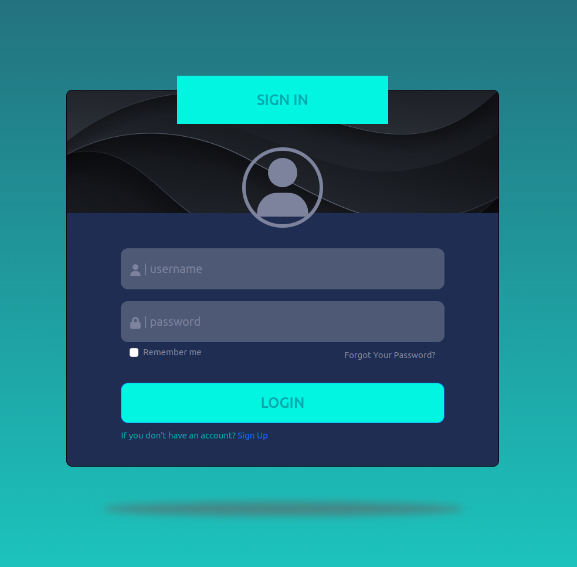
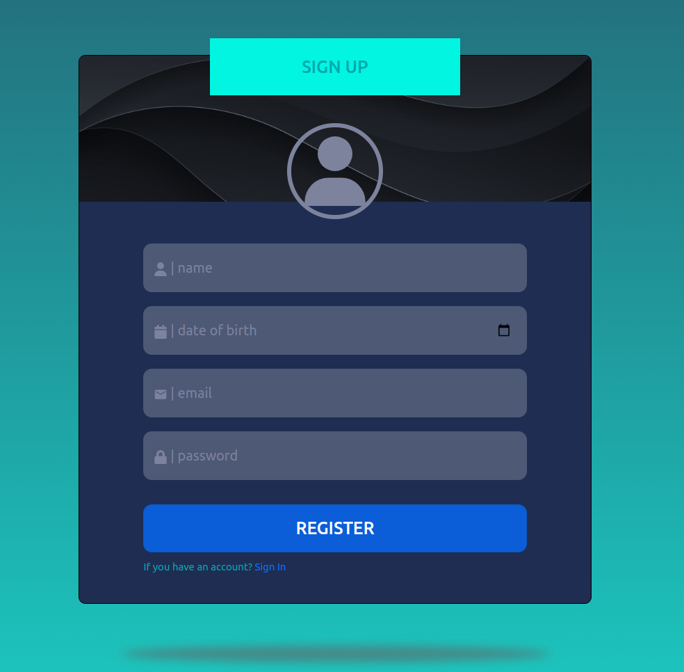
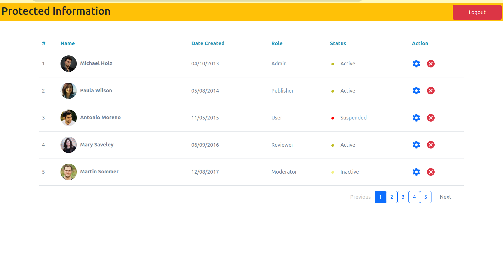

## Getting Started with Create React App
# Strictly Nodej.js USED (no Express.js)

## Pages 





## Application SetUp

- MongoDB needs to be in running after the you can follow following
### DEVELOPMENT MODE

- rename file example.development.env to .env or use following command
- install node package
- start server in development mode

```
cd backend
cp example.development.env .env
npm install
npm run dev

```

- open new terminal follow these command respectively

```
cd client
cp example.development.env .env
npm install
npm start
```


### PRODUCTION MODE
### Update your .env file Credentials

- rename file example.production.env to .env or use following command
- install node package
- start server in development mode

```
cd backend
cp example.production.env .env
npm install
npm run start

```

- open new terminal follow these command respectively

```
cd client
cp example.production.env .env
npm install
npm run build
npm start
```

### Tech Stack used

```
React.js
react-bootstrap
react form
Redux
axios
Node.js
Json Web Token
MongoDB
```

### BONUS 
- added LOADING SPINNER, 404 page not found also implemented
